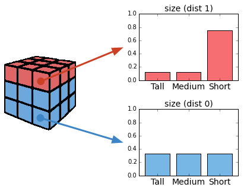
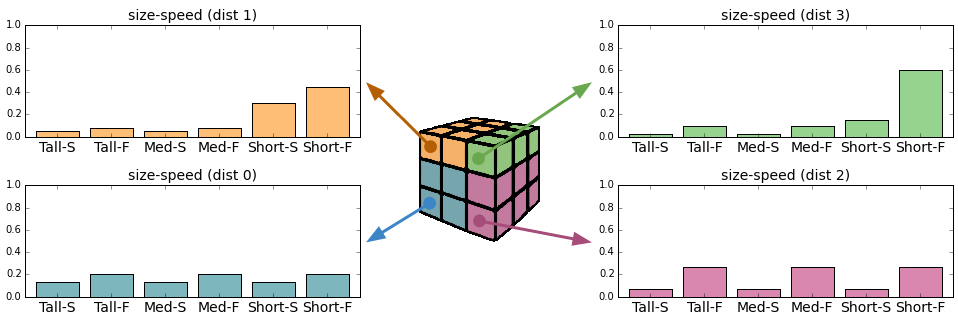

Extras
======

Spatial Distribution
--------------------

``SpatialDistribution`` class represents a discrete random variable whose probability distribution varies in 3-D space.
You can also think of it as a collection of different probability distributions each describing the same variable in different regions of space.

Contains three objects:

- *field* is a ``VoxelData`` object that covers a volume of space
- *distributions* is a pandas.DataFrame object that represents a group of discrete probability distributions
- *traits* is a pandas.DataFrame object that represents the possible values of the variable

Each voxel from *SpatialDistribution.field* contains the index of a **column** of *SpatialDistribution.distributions* (a single probability distribution).
Each row of *distributions* matches one row in *SpatialDistribution.traits*.
Thus, when assigning a value to a position in space, we find the corresponding voxel in *field* and the associted *distributions* column containing the discrete probabilites; and then when a value is chosen, the row that corresponds
can be looked up in *traits*.

Example
~~~~~~~

Imagine that we want to model the neurons in a piece of brain tissue.
We can classify neurons by their morphology in three different types: *Tall*, *Medium* or *Short*.
We know that these are usually equally probable in this piece of tissue but it happens that in a
particular region, the type *Short* is much more probable than any of the other ones.
We could think of two probability distributions for the same variable *size*: the uniform
distribution (dist 0) for most of the space, and an non-uniform one (dist 1) for that particular region.

To represent this setup, we could use a SpatialDistribution object with the components:

- traits: the table with each possible value of *size*.

    +--------+
    |  size  |
    +========+
    |  Tall  |
    +--------+
    | Medium |
    +--------+
    |  Short |
    +--------+

- distributions: each distribution as a column. Notice how they add up to 1.

    +--------+--------+
    | dist 0 | dist 1 |
    +========+========+
    |  0.333 |  0.125 |
    +--------+--------+
    |  0.333 |  0.125 |
    +--------+--------+
    |  0.333 |  0.75  |
    +--------+--------+

- field: a 3-D matrix where each value is either 0 (for the uniform distribution)
  or 1 (for the non-uniform one). ::

    [[1, 1, 1, 1],
     [0, 0, 0, 0],
     [0, 0, 0, 0],
     [0, 0, 0, 0], ...]

Note: The values (0, 1) refer to the column index of *distributions*.

The snippet of code that builds this example is:

.. code-block:: python

    import numpy as np
    import pandas as pd

    from voxcell.traits import SpatialDistribution

    traits = pd.DataFrame({'size': ['Tall', 'Medium', 'Short']})

    distributions = pd.DataFrame({
        0: [0.333, 0.333, 0.333],
        1: [0.125, 0.125, 0.75]
    })

    field = np.zeros((3, 3, 3), dtype=np.uint)
    field[:, 0, :] = 1

    sd = SpatialDistribution(field, distributions, traits)

Multivalue
^^^^^^^^^^

Note that since traits is a table, we can deal with multiple properties at once.

For instance, imagine that in the previous example, we can also classify the neurons by a
different criteria: whether they are *Slow* spiking (S) or *Fast* spiking (F).
We don't know the distribution for this *speed* variable on its own but we happen to know it
for the two variables together.

We can model this case with a single SpatialDistribution object.
The traits table has one column for each variable and one row for each known combination of the values.

    +--------+-------+
    |  size  | speed |
    +========+=======+
    |  Tall  |  Fast |
    +--------+-------+
    |  Tall  |  Slow |
    +--------+-------+
    | Medium |  Fast |
    +--------+-------+
    | Medium |  Slow |
    +--------+-------+
    |  Short |  Fast |
    +--------+-------+
    |  Short |  Slow |
    +--------+-------+

The snippet of code that builds this example is:

.. code-block:: python

    import numpy as np
    import pandas as pd

    from voxcell.traits import SpatialDistribution

    traits = pd.DataFrame({
      'size':
          ['Tall', 'Tall', 'Medium', 'Medium', 'Short', 'Short'],
      'speed':
          ['Slow', 'Fast', 'Slow', 'Fast', 'Slow', 'Fast']
    })

    distributions = pd.DataFrame({
        0: [0.1332, 0.1998, 0.1332, 0.1998, 0.1332, 0.1998],
        1: [0.05, 0.075, 0.05, 0.075, 0.3, 0.45],
        2: [0.0666, 0.2664, 0.0666, 0.2664, 0.0666, 0.2664],
        3: [0.025, 0.1, 0.025, 0.1, 0.15, 0.6]
    })

   field = np.zeros((3, 3, 3), dtype=np.uint)
   field[:, 0, :] = 1

   sd = SpatialDistribution(field, distributions, traits)

Vector Field
------------

TODO
