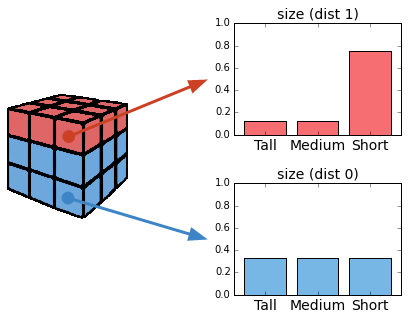
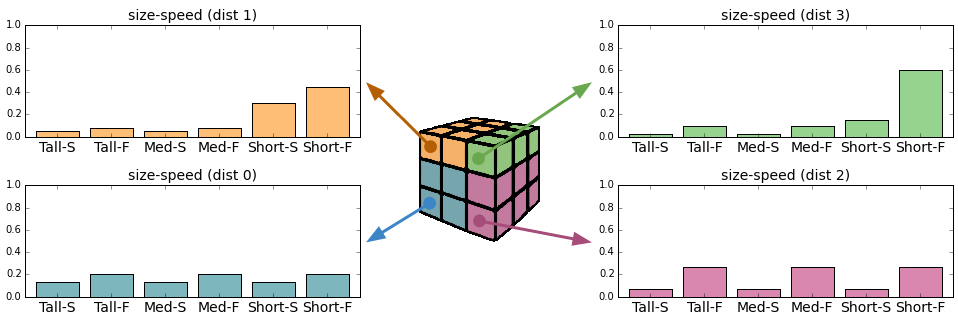

Data Objects
============

VoxelData
---------

The central container class in voxcell. Uses a 3-rank numpy array to represent a series of voxels
in space and some metadata to identify the volume covered by the data relative to a global atlas.
The meaning of the value contained by each voxel will change depending on the usage.

Voxcell supports loading and saving NRRD_ files as support for basic voxel data:

.. code-block:: python

    from voxcell.core import VoxelData
    density = VoxelData.load_nrrd('/path/to/file.nrrd')
    density.save_nrrd('/path/to/file.nrrd')

VoxelData objects are also used to hold vector fields (each voxel contains a 3-D vector)
and orientation fields (each voxel contains a 3x3 rotation matrix) which define orientations
in space. These can be used, for example, to orient reconstructed morphologies.
See the API of :ref:`vfapi` for more details.

Data Examples
~~~~~~~~~~~~~

The AIBS_ provides volumetric data for cell densities and gene markers free
to download from their website. The format is often uchar (8bit) grayscale values volume taken from
the reconstructed brain at 25 µm resolution.

- Download `general cell body position <http://api.brain-map.org/api/v2/well_known_file_download/113567585>`_
  (from `MouseBrain API`_ search for "atlasVolume:").  These are Nissl stained data.

- Download `glia body positions <http://mouse.brain-map.org/search/show?page_num=0&page_size=26&no_paging=false&exact_match=false&search_term=gfap&search_type=gene>`_.
  These are the gene expression stains of Gfap, so we have density/energy/intensity voxel information
  at lower resolution.

- Download `inhibitory/excitatory body positions <http://mouse.brain-map.org/search/show?page_num=0&page_size=26&no_paging=false&exact_match=false&search_term=gad&search_type=gene>`_
  (from `MouseBrain API`_
  search for 'Packing of 3-D volumetric data into a 1-D numerical array').
  These are the gene expression stains of Gad.

- Download the `atlas <http://api.brain-map.org/api/v2/well_known_file_download/197642854>`_
  (from `MouseBrain API`_, search for "annotation:").
  An atlas is a dataset where each voxel maps to a brain region.
  The format is in uint (32bit) of structural annotation volume at 25 µm resolution.
  The value represents the ID of the finest level structure annotated for the voxel.

Hierarchy
---------

The Hierarchy object represents the relationship bewteen the regions that compose an atlas.
Note that the 3-D mask for any structure is composed of all voxels of the atlas annotated for that
structure and for any of its descendants in the structure hierarchy.

Voxcell supports loading JSON_ files as support for hierarchy data:

.. code-block:: python

    from voxcell.core import Hierarchy
    hierarchy = Hierarchy.load('/path/to/file.json')

Example
~~~~~~~

The AIBS_ provides a hierarchy free to download from their website.

Download the `structured hierarchy <http://api.brain-map.org/api/v2/structure_graph_download/1.json>`_.
Structures are organized in a hierarchy where each Structure has one parent
denoting a "part-of" relationship.

CellCollection
--------------

A container for a collection of cells that are under construction. It uses numpy arrays to store
multi-dimensional numerical attributes (3-D position and orientation) and a pandas.DataFrame object
to represent any other property.

Voxcell supports saving cell collections as :doc:`mvd3` files:

.. code-block:: python

    from voxcell.core import CellCollection
    cells = CellCollection()
    # ...
    cells.save('/path/to/file.h5')

.. _NRRD: http://teem.sourceforge.net/nrrd/format.html
.. _JSON: http://www.json.org
.. _AIBS: http://alleninstitute.org/
.. _`MouseBrain API`: http://help.brain-map.org//display/mousebrain/API

SpatialDistribution
-------------------

The heavy lifting class in voxcell. It represents a discrete random variable whose probability
distribution varies in 3-D space. You can also think of it as a collection of different probability
distributions each describing the same variable in different regions of space.

Contains three objects

- *field* is a VoxelData_ object that covers a volume of space.
- *distributions* is a pandas.DataFrame object that represents a group of discrete probability distributions.
- *traits* is a pandas.DataFrame object that represents the possible values of the variable.

Each voxel from *SpatialDistribution.field* contains the index of a **column** of *SpatialDistribution.distributions*
(a single probability distribution). Each row of *distributions* matches
one row in *SpatialDistribution.traits*. Thus, when assigning a value to a position in space,
we find the corresponding voxel in *field* and the associted *distributions* column
containing the discrete probabilites: and then when a value is chosen, the row that corresponds
can be looked up in *traits*.

Example
~~~~~~~

Imagine that we want to model the neurons in a piece of brain tissue. We can classify neurons
by their morphology in three different types: *Tall*, *Medium* or *Short*.
We know that these are usually equally probable in this piece of tissue but it happens that in a
particular region, the type *Short* is much more probable than any of the other ones.
We could think of two probability distributions for the same variable *size*: the uniform
distribution (dist 0) for most of the space, and an non-uniform one (dist 1) for that particular region.

To represent this setup, we could use a SpatialDistribution object with the components:

- traits: the table with each possible value of *size*.

    +--------+
    |  size  |
    +========+
    |  Tall  |
    +--------+
    | Medium |
    +--------+
    |  Short |
    +--------+

- distributions: each distribution as a column. Notice how they add up to 1.

    +--------+--------+
    | dist 0 | dist 1 |
    +========+========+
    |  0.333 |  0.125 |
    +--------+--------+
    |  0.333 |  0.125 |
    +--------+--------+
    |  0.333 |  0.75  |
    +--------+--------+

- field: a 3-D matrix where each value is either 0 (for the uniform distribution)
  or 1 (for the non-uniform one). ::

    [[1, 1, 1, 1],
     [0, 0, 0, 0],
     [0, 0, 0, 0],
     [0, 0, 0, 0], ...]

Note: The values (0, 1) refer to the column index of *distributions*.

The snippet of code that builds this example is:

.. code-block:: python

   from voxcell.traits import SpatialDistribution
   import pandas as pd
   import numpy as np

   traits = pd.DataFrame({'size': ['Tall', 'Medium', 'Short']})

   distributions = pd.DataFrame({0: [0.333, 0.333, 0.333],
                                 1: [0.125, 0.125, 0,75]})

   field = np.zeros((3, 3, 3), dtype=np.uint)
   field[:, 0, :] = 1

   sd = SpatialDistribution(field, distributions, traits)

Multivalue
^^^^^^^^^^

Note that since traits is a table, we can deal with multiple properties at once.

For instance, imagine that in the previous example, we can also classify the neurons by a
different criteria: whether they are *Slow* spiking (S) or *Fast* spiking (F).
We don't know the distribution for this *speed* variable on its own but we happen to know it
for the two variables together.

We can model this case with a single SpatialDistribution object. The traits table has one column
for each variable and one row for each known combination of the values.

    +--------+-------+
    |  size  | speed |
    +========+=======+
    |  Tall  |  Fast |
    +--------+-------+
    |  Tall  |  Slow |
    +--------+-------+
    | Medium |  Fast |
    +--------+-------+
    | Medium |  Slow |
    +--------+-------+
    |  Short |  Fast |
    +--------+-------+
    |  Short |  Slow |
    +--------+-------+

The snippet of code that builds this example is:

.. code-block:: python

   from voxcell.traits import SpatialDistribution
   import pandas as pd
   import numpy as np

   traits = pd.DataFrame({'size': ['Tall', 'Tall', 'Medium', 'Medium', 'Short', 'Short'],
                          'speed': ['Slow', 'Fast', 'Slow', 'Fast', 'Slow', 'Fast']})

   distributions = pd.DataFrame({0: [0.1332, 0.1998, 0.1332, 0.1998, 0.1332, 0.1998],
                                 1: [0.05, 0.075, 0.05, 0.075, 0.3, 0.45],
                                 2: [0.0666, 0.2664, 0.0666, 0.2664, 0.0666, 0.2664],
                                 3: [0.025, 0.1, 0.025, 0.1, 0.15, 0.6]})

   field = np.zeros((3, 3, 3), dtype=np.uint)
   field[:, 0, :] = 1

   sd = SpatialDistribution(field, distributions, traits)
